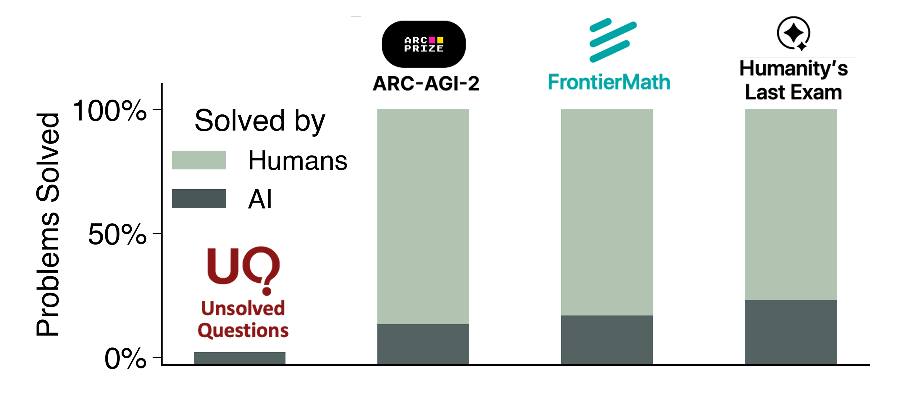

<div align="center">

# UQ: Assessing Language Models on Unsolved Questions

🌐 [Website](https://uq.stanford.edu/) | 📄 [Paper](https://arxiv.org/abs/2508.17580) | 🤗 [Dataset](https://hf.co/datasets/uq-project/uq)

</div>

UQ provides resources to assess LLMs on unsolved questions: (1) UQ-Dataset provides curated unsolved questions; (2) UQ-Validators are LLM-based validation strategies to check answer-correctness (3) UQ-Platform is a website to engage with the questions and answers.

 

- [Dataset](#dataset)
- [Evaluation](#evaluation)
- [Validation](#validation)
- [Visuals](#visuals)
- [Citation](#citation)

## Dataset

You can load the data from [🤗 uq-project/uq](https://huggingface.co/datasets/uq-project/uq) via:

```python
# pip install -q datasets
from datasets import load_dataset
dataset = load_dataset("uq-project/uq", split="test")
```

## Evaluation

```bash
# Please specify your API key in `key.env`
python gen_answer.py --model_name o3
```


## Installation

UQ Validator is now available as a pip-installable package:

```bash
# Install from source
git clone https://github.com/uq-project/UQ.git
cd UQ
pip install -e .

# Or install from PyPI (coming soon)
pip install uq-validator
```

## Validation

Once you have your model predictions, you can use UQ-validators via:

### Python Script

```bash
# Each sample in input file should include question_id and answer
python validate.py --input_file your_answers --model o3 --strategy sequential --turns 3 \
    --multi_turn_voting majority
```

### Command Line Interface

```bash
# Basic validation
uq-validate --input_file your_answers.jsonl --dataset questions.jsonl --strategy relevance

# Sequential validation with multiple strategies
uq-validate --input_file your_answers.jsonl --dataset questions.jsonl --strategy sequential \
    --sequential_strategies relevance cycle_consistency factual_error final_answer

# Multi-sample validation with voting
uq-validate --input_file your_answers.jsonl --dataset questions.jsonl --strategy total_correctness \
    --samples 3 --resampling_voting majority
```

## Citation

```bibtex
@misc{nie2025uqassessinglanguagemodels,
      title={UQ: Assessing Language Models on Unsolved Questions}, 
      author={Fan Nie and Ken Ziyu Liu and Zihao Wang and Rui Sun and Wei Liu and Weijia Shi and Huaxiu Yao and Linjun Zhang and Andrew Y. Ng and James Zou and Sanmi Koyejo and Yejin Choi and Percy Liang and Niklas Muennighoff},
      year={2025},
      eprint={2508.17580},
      archivePrefix={arXiv},
      primaryClass={cs.CL},
      url={https://arxiv.org/abs/2508.17580}, 
}
```
